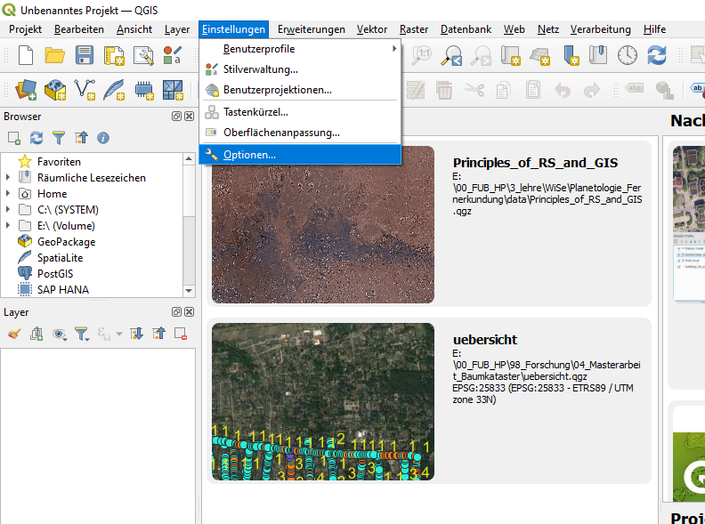

# QGIS

## Tutorial 1 - Getting to know the QGIS graphical user interface

**Abstract** 
After completing this tutorial, the participant has an understanding
of the Q-GIS graphical user interface, knows how to activate and de-
activate windows, is familiar with the QGIS-toolboxes and is able to
set the language of QGIS.

## 1 Setting the language of QGIS

Before starting to work with QGIS we will set the language settings of QGIS to English. This is necessary as all descriptions of the Tutorials will refer to the english QGIS version. Working in another language might cause unnecessary confusions. To switch the language to English, we rst start QGIS by double-clicking the desktop icon called \QGIS Desktop 2.x.x with GRASS 7.x.x" (in your case the x-es will be some numbers indicating the QGIS version you have installed on your computer). Alternatively you can start QGIS from the start menu of your computer - the exact way how to do this varies with operating system and the Linux/Windows/Apple operating system version you have installed - but it is assumed that you know how to start a program on your computer. 

Then within QGIS, we open the "**Settings**" menu in the main menu bar of QGIS and select -> "**Options**" as shown in Figure 1.

